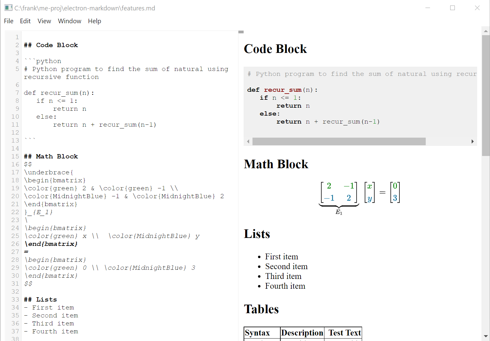
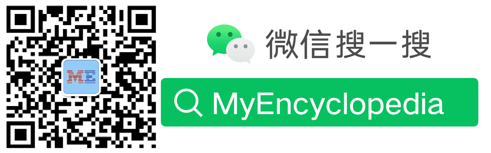

## Mark-ME

Since typora is not free anymore,`Mark-ME` aims to be free electron Markdown editor on all platforms (Windows, Mac, Linux), though not open-sourced at the moment.
Mark-ME is intended not only for composing markdown files but also for platform of writing Latex and formatting and publishing to Wechat, Toutiao, Medium, Bilibili etc. It's in very early stage. If you like it, pls star it. Any feature requests, pls leave issues in github.

## Downloads

[Release 0.1.0 · MyEncyclopedia/Mark-ME · GitHub](https://github.com/MyEncyclopedia/Mark-ME/releases/tag/0.1.0)

## Screenshots

## Supported Features.

- Mathjax Block
- Code Block
- Copy as HTML
- Tables
- Remote Images
- Links
- Drag Drop File

## Roadmap

- File modification detection
- Save file automatically
- Local images
- Download remote images and replace ref in markdown
- Image watermark
- Inline mathjax
- **Latex full fledge editor**
- **Immense Editing** like typora

## Wechat Channel

If you are interested in Mark-ME or as an AI/Tech/Maths blog writer or enthusiastic, welcome to subscribe to my wechat channel.

Some posts are published to following sites.

[Myencyclopedia blog @ https://myencyclopedia.top/blog/](https://myencyclopedia.top/blog/)

[Github.io replhttps://myencyclopedia.github.io/](https://myencyclopedia.github.io/)